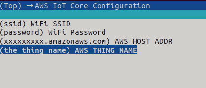

## ESP32 AWS IoT Core

- Environment: ESP IDF v4.3

### Config

- use `idf.py menuconfig` to config the wifi and host address, thing name



### Certificate 

- copy the Certificate/Key file to the ./main/cert path.

```
aws-root-ca.pem
certificate.pem.crt
private.pem.key
```
